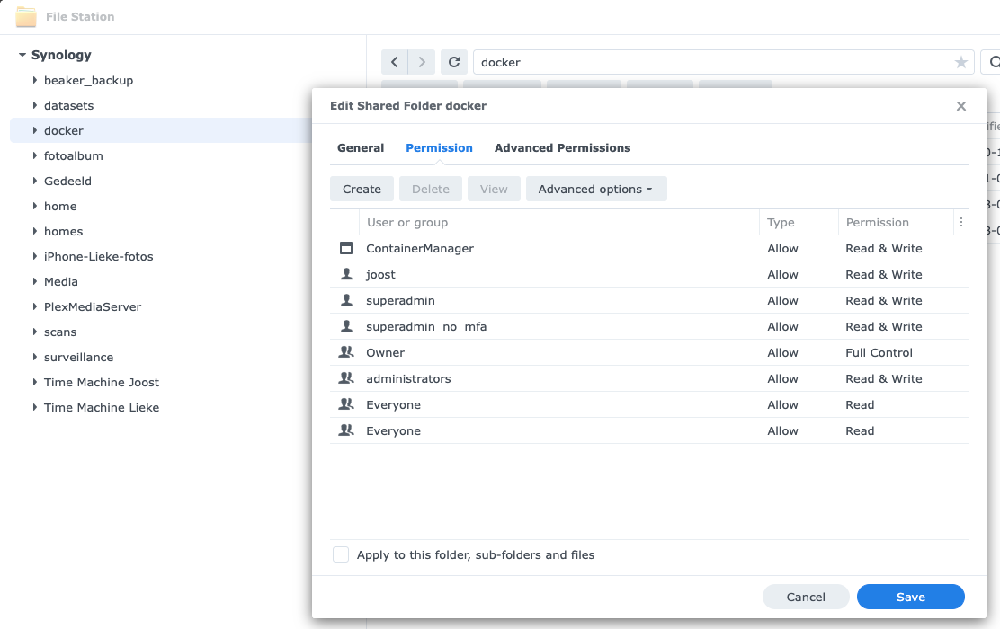

# VS Code Tunnel Docker image

## Changes by Joost

Changes: 
1. file `entrypoint.sh` and added `--name synology` to the tunnel command.
2. file `dockerfile` changed USER_UID to 1034 (Synology superuser) because docker-data (/volume1/docker) was readonly.
3. Share docker (/volume1/docker) had different permission. Using the Synology GUI, select 'File Station, next right-click 'docker' share for properties. Slect the 'Permissions' tab and tick the 'Apply to this folder, sub-folders and files' and Save. The Tunnel got read and write rights after I applied 2 and 3. I also noticed ContainerManager as user:




Next:
- Clone to Synology NAS (/Volume1/docker):
```
git clone https://github.com/JoostHazelzet/vscode-tunnel.git`
cd vscode-tunnel
```
- Build the custom image which takes 20-30 minutes and ends with final line 'Successfully tagged vscode-tunnel-customer:latest':
```
sudo docker build -t vscode-tunnel-custom .
```
- Start the container using this custom image:
```
sudo docker run -d --name vscode-tunnel \
  -v vscode-tunnel:/volume1/docker \
  -v /volume1/docker:/docker-data:rw \
  -p 8080:8080 \
  vscode-tunnel-custom
```
- Authenticate and Start the Tunnel. Details can be found the container logs:
```
sudo docker logs -f vscode-tunnel
```
- Open folder `docker-data` which is mounted to `/volume1/docker`.

## Overview

This container image includes the **VS Code CLI** along with useful build dependencies and tools (Git, Java, Maven, NodeJS, Python, Docker CLI, kubectl, helm, gcloud, ...).

When run without arguments, it will automatically start in [tunnel mode](https://code.visualstudio.com/docs/remote/tunnels) and await authentication. Make sure to check the logs if you are running it in the background and follow the displayed instructions.

After that you can connect to this container as a remote tunnel from anywhere on the web or desktop and develop in an isolated environment.

## Usage

The following commands can be used to start a tunnel from a machine with [Docker](https://docs.docker.com/engine/) installed.

```
# Create a dedicated volume for persistence
docker volume create vscode-tunnel

# Start tunnel in the background
docker run -d --name vscode-tunnel -v vscode-tunnel:/home/vscode ghcr.io/fcrespel/vscode-tunnel:master

# Check the logs for authentication and connection instructions
docker logs -f vscode-tunnel

# Stop tunnel after usage
docker stop vscode-tunnel

# Start again existing tunnel
docker start vscode-tunnel

# Delete container and data
docker stop vscode-tunnel
docker rm vscode-tunnel
docker volume rm vscode-tunnel
```

As an alternative, you may also want to use a [Docker Compose](https://docs.docker.com/compose/) file such as the following.

```
services:
  vscode-tunnel:
    image: ghcr.io/fcrespel/vscode-tunnel:master
    restart: unless-stopped
    hostname: vscode-tunnel
    volumes:
      - vscode-tunnel:/home/vscode
volumes:
  vscode-tunnel:
```

## Build arguments

The following arguments can be used during the build phase to configure the image.

| Argument | Description | Default value |
| -------- | ----------- | ------------- |
| CLOUDSDK_VERSION | Google Cloud SDK version to install | 484.0.0 |
| DOCKER_VERSION | Docker CLI version to install | 27.0.3 |
| HELM_VERSION | Helm version to install | 3.15.3 |
| KUBECTL_VERSION | kubectl version to install | 1.30.3 |
| MAVEN_VERSION | Maven version to install | 3.9.8 |
| ROOT_CA_URL | Additional root certificate authority URL to install | |
| TF_VERSION | Terraform version to install | 1.9.2 |
| USER_GID | Group ID of the user to create | 100 |
| USER_UID | User ID of the user to create | 1000 |
| VSCODE_VERSION | VS Code CLI version to install | 1.91.1 |

## Volumes

The following container paths can be used to mount a dedicated volume.

| Path | Description |
| ---- | ----------- |
| /home/vscode | User configuration and data |
